# auth

Authentication for the `webfetch` tool. When `webfetch` encounters a protected URL (HTTP 401/403), this module discovers how to authenticate using OAuth standards, walks the user through the auth flow, and stores credentials for reuse.

## How it works

When `webfetch` gets a 401 or 403 response, the orchestration layer in `orchestrate.ts` (`handleAuthChallenge()`) drives this sequence:

1. **Parse the `WWW-Authenticate` header** (`www-authenticate.ts`) to detect what authentication the server requires. If the server includes a `resource_metadata` URL in a Bearer challenge ([RFC 9728 &sect;5.1](https://www.rfc-editor.org/rfc/rfc9728.html#section-5.1)), that URL is used in the next step.

2. **Discover the authorization server** (`discovery.ts`). Fetch the resource's `.well-known/oauth-protected-resource` metadata ([RFC 9728](https://www.rfc-editor.org/rfc/rfc9728.html)) to find which authorization servers protect it, then fetch each server's `.well-known/oauth-authorization-server` metadata ([RFC 8414](https://www.rfc-editor.org/rfc/rfc8414.html)) to learn its endpoints and capabilities. Falls back to `.well-known/openid-configuration` (OIDC Discovery) if RFC 8414 is not available.

3. **Resolve a client identity**. If a `client_id` is stored from a previous flow, reuse it. Otherwise, dynamically register a new client via [RFC 7591](https://www.rfc-editor.org/rfc/rfc7591.html) if the AS supports it.

4. **Execute the OAuth flow** (`flow.ts`):
   - **Authorization Code + PKCE** ([RFC 6749 &sect;4.1](https://www.rfc-editor.org/rfc/rfc6749.html#section-4.1) + [RFC 7636](https://www.rfc-editor.org/rfc/rfc7636.html)): Starts a local HTTP callback server on `127.0.0.1:19877` (with port fallback), delegates browser opening to the caller via the `Interaction` interface, waits for the callback with an authorization code, then exchanges the code (with PKCE verifier) for tokens.
   - **Device Authorization Grant** ([RFC 8628](https://www.rfc-editor.org/rfc/rfc8628.html)): For headless/SSH environments. Returns a `user_code` and `verification_uri` for the caller to display via the `Interaction` interface, then polls the token endpoint until authorization completes.

5. **Store the credential** (`webfetch-auth.ts`) and retry the original request with the `Authorization: Bearer` header.

On subsequent requests, stored tokens are attached automatically. Expired tokens are refreshed via the `refresh_token` grant before retrying.

## End-to-end flow

```mermaid
sequenceDiagram
    participant OC as OpenCode<br/>(webfetch tool)
    participant Store as Credential Store<br/>(webfetch-auth.json)
    participant RS as Resource Server
    participant AS as Authorization Server
    participant Browser as User's Browser

    rect rgb(40, 40, 60)
    Note over OC,RS: Phase 1 — Initial request
    OC->>Store: Look up stored credentials for URL
    Store-->>OC: Stored credential (if any)
    OC->>RS: GET url (+Authorization header if credential found)
    RS-->>OC: 401 or 403<br/>WWW-Authenticate: Bearer resource_metadata="..."
    end

    rect rgb(40, 50, 40)
    Note over OC,AS: Phase 2 — Discovery (RFC 9728 + RFC 8414)
    OC->>OC: Parse WWW-Authenticate header (RFC 9110 §11.6.1)
    OC->>OC: Extract resource_metadata URL from Bearer challenge (RFC 9728 §5.1)
    OC->>RS: GET /.well-known/oauth-protected-resource<br/>(or URL from WWW-Authenticate)
    RS-->>OC: Resource metadata:<br/>{ resource, authorization_servers, scopes_supported }
    OC->>AS: GET /.well-known/oauth-authorization-server (RFC 8414)<br/>fallback: /.well-known/openid-configuration
    AS-->>OC: AS metadata:<br/>{ issuer, authorization_endpoint, token_endpoint,<br/>registration_endpoint, grant_types_supported, ... }
    end

    OC->>OC: Prompt user for consent to authenticate

    rect rgb(50, 40, 40)
    Note over OC,Browser: Phase 3 — OAuth flow
    alt Authorization Code + PKCE (interactive)
        OC->>OC: Generate PKCE code_verifier + S256 code_challenge
        OC->>OC: Start local HTTP callback server on 127.0.0.1:19877
        opt No client_id available
            OC->>AS: POST registration_endpoint (RFC 7591 dynamic registration)
            AS-->>OC: { client_id, client_secret }
        end
        OC->>Browser: Open authorization URL in browser
        Browser->>AS: User authenticates and grants consent
        AS->>Browser: Redirect to http://127.0.0.1:19877/oauth/callback?code=...&state=...
        Browser->>OC: Local server receives callback with auth code
        OC->>OC: Validate state parameter (CSRF check)
        OC->>AS: POST token_endpoint<br/>(grant_type=authorization_code, code, code_verifier)
        AS-->>OC: { access_token, refresh_token, expires_in }
    else Device Authorization Grant (headless / SSH)
        opt No client_id available
            OC->>AS: POST registration_endpoint (RFC 7591)
            AS-->>OC: { client_id }
        end
        OC->>AS: POST device_authorization_endpoint (RFC 8628)
        AS-->>OC: { device_code, user_code, verification_uri }
        OC->>OC: Display verification_uri + user_code to user
        loop Poll token endpoint
            OC->>AS: POST token_endpoint<br/>(grant_type=urn:ietf:params:oauth:grant-type:device_code)
            AS-->>OC: "authorization_pending" / "slow_down" / tokens
        end
    end
    end

    rect rgb(40, 40, 60)
    Note over OC,RS: Phase 4 — Store credentials + retry
    OC->>Store: Store credential<br/>(access_token, refresh_token, client_id, issuer, expiry)
    OC->>RS: Retry GET url (Authorization: Bearer token)
    Note over OC,RS: redirect: "error" to prevent token leakage on cross-origin redirects
    RS-->>OC: 200 OK — protected content
    end
```

## Modules

### `www-authenticate.ts`

Parses `WWW-Authenticate` response headers per [RFC 9110 &sect;11.6.1](https://www.rfc-editor.org/rfc/rfc9110.html#section-11.6.1). Handles the notoriously ambiguous grammar: token68 vs. auth-params disambiguation, quoted-string with backslash escaping, and comma-separated challenges. Extracts the `resource_metadata` URL from Bearer challenges per [RFC 9728 &sect;5.1](https://www.rfc-editor.org/rfc/rfc9728.html#section-5.1).

### `discovery.ts`

Fetches and validates protected resource metadata ([RFC 9728](https://www.rfc-editor.org/rfc/rfc9728.html)) and authorization server metadata ([RFC 8414](https://www.rfc-editor.org/rfc/rfc8414.html)). Constructs `.well-known` URLs per the RFC insertion algorithms, validates response `Content-Type` and `issuer`/`resource` field matches, type-checks all metadata fields, rejects redirects on resource metadata (RFC 9728 &sect;3.2), and falls back to OIDC Discovery (`.well-known/openid-configuration`) for AS metadata.

Includes SSRF protections: metadata URLs targeting private networks (RFC 1918, RFC 6598, loopback, link-local, IPv6 ULA, tunneling protocols) are rejected when the resource itself is on a public network. DNS resolution is performed on hostnames to prevent rebinding attacks. Loopback is exempted for local development (RFC 8252 &sect;7.3).

### `flow.ts`

Executes OAuth flows:

- **Authorization Code + PKCE**: Accepts a `CallbackServer` and `Interaction` interface from the caller, generates PKCE `code_verifier` + `S256` `code_challenge` per [RFC 7636](https://www.rfc-editor.org/rfc/rfc7636.html), delegates browser opening to the `Interaction` interface, waits for the callback, validates the `state` parameter (CSRF protection), and exchanges the authorization code for tokens. Client registration ([RFC 7591](https://www.rfc-editor.org/rfc/rfc7591.html)) is deferred until after the server binds so the `redirect_uri` port matches. A default `LocalCallbackServer` implementation using `node:http` is provided, starting on `127.0.0.1:19877` with port fallback.

- **Device Authorization Grant**: For headless/SSH environments per [RFC 8628](https://www.rfc-editor.org/rfc/rfc8628.html). Initiates the device authorization request, returns a `user_code` + `verification_uri` for the caller to display via the `Interaction` interface, and polls the token endpoint with `slow_down` backoff. Device code `expires_in` is clamped to 10 minutes to prevent a malicious AS from keeping the poll loop alive indefinitely.

- **Dynamic Client Registration**: Registers OpenCode as an OAuth client per [RFC 7591](https://www.rfc-editor.org/rfc/rfc7591.html) when no `client_id` is configured.

### `webfetch-auth.ts`

Credential types, matching logic, and pure functions for the webfetch auth system. Defines the `CredentialStore` interface and `Credential` type. Supports `bearer` and `basic` auth schemes. Credential lookup (`lookup()`) uses three-tier URL matching: exact URL, then origin, then longest path-prefix match (path-segment-boundary-aware, per [RFC 6750](https://www.rfc-editor.org/rfc/rfc6750.html#section-3) protection space semantics). Handles token refresh via the `refresh_token` grant ([RFC 6749 &sect;6](https://www.rfc-editor.org/rfc/rfc6749.html#section-6)). Provides `resolveCredentials()` which combines lookup + auto-refresh for Layer 1 (pre-request credential injection).

### `store.ts`

File-based `CredentialStore` implementation. Persists credentials as JSON at `$XDG_DATA_HOME/opencode/webfetch-auth.json` (file mode `0600`, directory mode `0700`). Uses an in-memory mutex to serialize concurrent operations and atomic writes (write-to-tmp-then-rename) to prevent corruption on crash.

### `orchestrate.ts`

Auth orchestration — Layer 2. Ties together: challenge parsing (`www-authenticate.ts`), metadata discovery (`discovery.ts`), user consent prompt via the `Interaction` interface, client resolution (stored credentials or dynamic registration), flow selection (auth code vs. device code via `flow.ts`), credential storage, and retry with credentials. Accepts a pluggable `CredentialStore`, `CallbackServer`, and `Interaction` to keep the orchestration logic decoupled from opencode-specific concerns.

### `index.ts`

Pre-existing module for provider authentication (API keys, OAuth for LLM providers). Not part of the webfetch auth flow.
